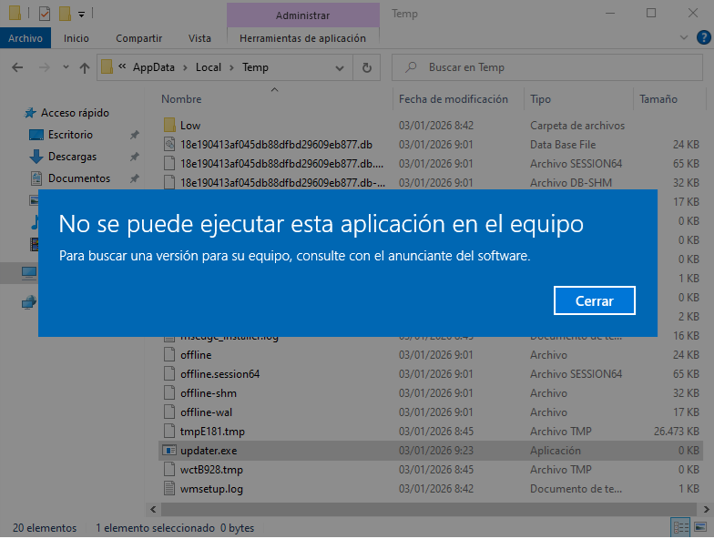
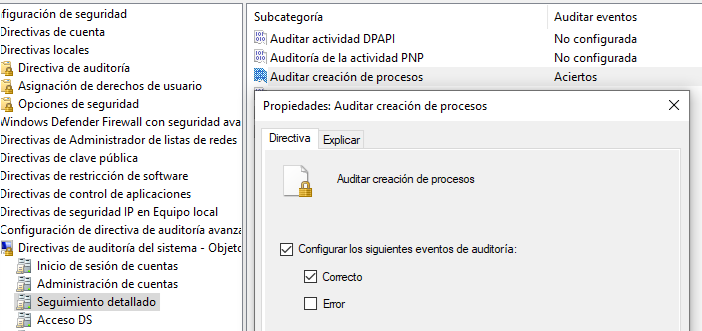
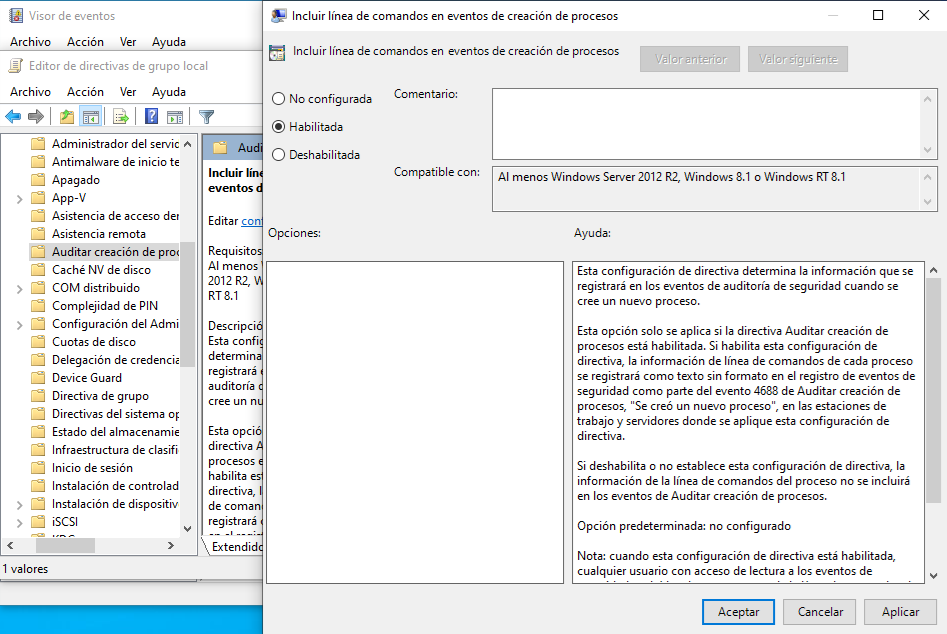
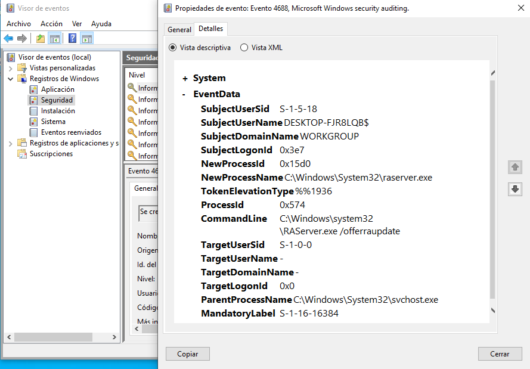

# Informe de Incidente – SOC Base (Endpoint Windows)

## Resumen del incidente
Se detectó un **intento de ejecución de un archivo con extensión `.exe`** desde un **directorio escribible por el usuario** en un endpoint Windows.  
El archivo no se ejecutó correctamente, pero el intento fue suficiente para iniciar una investigación SOC.

---

## Contexto operativo
- Entorno: Endpoint Windows
- Herramientas: Capacidades nativas del sistema operativo
- Rol: Analista SOC junior
- Sin SIEM ni EDR disponibles

---

## Disparador
El disparador del incidente fue el **intento de ejecución** de un archivo ubicado en una ruta no habitual para binarios legítimos (`AppData\Local\Temp`).

**Evidencia:**  

---

## Investigación

### Revisión inicial de registros
Se realizó una revisión de los siguientes registros:
- **Aplicación:** sin eventos relevantes asociados al intento.
- **Sistema:** sin eventos relevantes.
- **Seguridad:** no se observaron eventos de creación de procesos.

**Conclusión inicial:**  
La ausencia de eventos de creación de procesos indicaba una **limitación de visibilidad** en el endpoint.

---

## Identificación de la carencia
Se determinó que la **auditoría de creación de procesos no estaba habilitada**, lo que impedía registrar intentos de ejecución y dificultaba el análisis.

---

## Acción correctiva
Se habilitó la **auditoría de creación de procesos** para mejorar la visibilidad del endpoint.

**Evidencia:**  

---

## Validación
Tras habilitar la auditoría, se repitió el intento de ejecución.  
En esta ocasión, se generó correctamente el **evento 4688 (creación de proceso)** en el registro de Seguridad.

**Evidencia:**  

---

## Mejora adicional
Durante la validación se observó que el evento 4688 **no incluía la línea de comandos**, lo que limitaba el contexto del análisis.

Se habilitó la directiva para **incluir la línea de comandos en los eventos de creación de procesos**, mejorando la calidad de la información registrada.

**Evidencia:**  

---

## Conclusión
El incidente evidenció una **carencia de visibilidad** en el endpoint que impedía una investigación efectiva.  
Mediante la habilitación de auditoría y la mejora del detalle de los eventos, se logró aumentar la capacidad de detección y análisis ante intentos de ejecución sospechosos.

---

## Lecciones aprendidas
- La ausencia de eventos también es un hallazgo relevante.
- La auditoría adecuada es clave para la detección temprana.
- Mejorar el contexto de los eventos reduce la incertidumbre en el análisis SOC.

---

---

# Incident Report – SOC Base (Windows Endpoint)

## Incident summary
An **attempt to execute a `.exe` file** from a **user-writable directory** was detected on a Windows endpoint.  
The file did not execute successfully, but the attempt was enough to trigger a SOC investigation.

---

## Operational context
- Environment: Windows endpoint
- Tools: Native operating system capabilities
- Role: Junior SOC analyst
- No SIEM or EDR available

---

## Trigger
The incident was triggered by an **execution attempt** of a file located in an uncommon path for legitimate binaries (`AppData\Local\Temp`).

**Evidence:**  

---

## Investigation

### Initial log review
The following logs were reviewed:
- **Application:** no relevant events related to the attempt.
- **System:** no relevant events.
- **Security:** no process creation events were observed.

**Initial conclusion:**  
The absence of process creation events indicated a **lack of visibility** on the endpoint.

---

## Identified gap
It was determined that **process creation auditing was not enabled**, preventing proper logging of execution attempts.

---

## Corrective action
**Process creation auditing** was enabled to improve endpoint visibility.

**Evidence:**  

---

## Validation
After enabling auditing, the execution attempt was repeated.  
This time, **event 4688 (process creation)** was successfully generated in the Security log.

**Evidence:**  

---

## Additional improvement
During validation, it was observed that event 4688 **did not include command-line information**, limiting analysis context.

A policy was enabled to **include command-line details in process creation events**, improving the quality of logged data.

**Evidence:**  

---

## Conclusion
This incident revealed a **visibility gap** on the endpoint that limited effective investigation.  
By enabling auditing and improving event detail, detection and analysis capabilities for suspicious execution attempts were significantly improved.

---

## Lessons learned
- The absence of logs is also a relevant finding.
- Proper auditing is essential for early detection.
- Richer event context reduces uncertainty during SOC analysis.
